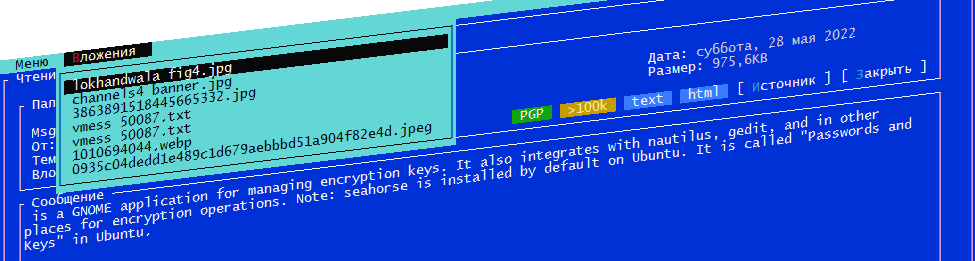
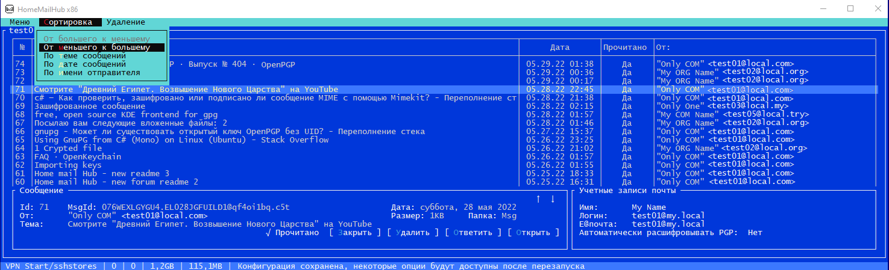

# HomeMailHub
Secure, anonymous, domestic home mail hub `MTA` / `MUA`

 Hub of mail between accounts in different e-mail systems,
 used to route e-mail, also works as your own mail server.

 To receive and send mail from a mail client using `POP3`, `SMTP`, enabled `STARTSSL` encryption.
 Collecting mail from external servers is carried out via the `POP3`, `IMAP`, `SMTP`, supports `SSL` / `TLS` encryption, `STARTSSL`.

 Supports anonymous mode consisting of a set of measures to determine the difficulty sender / recipient when sending and receiving mail from external servers.

  
 
### Built-in encryption is:
 - `VPN` client Wireguard,
 - `SSH` tunnel, implements the interface `SOCK5`, also using other applications,
 - support for `HTTP`, `HTTPS`, `SOCK4`, `SOCK5` proxy server,
 - automatic enumeration of proxies in search of the first workable,
 - `PGP` / `GPG` encryption of messages

 In establishing the connection may use a serial tunneling, `VPN Wireguard` -> `SSH tunnel` -> `HTTP`, `HTTPS`, `SOCK4`, `SOCK5` proxy servers.  
 At each stage of sending / receiving mail is held network testing, evaluated all the network routes to the specified node.
 Further routes are compared with the "forbidden route" table and in case of a match, the connection is broken immediately.

 It is also possible to include tunneling chain on an ongoing basis, to use anonymous access by other applications.

### Options enhance privacy-mail:
 - encryption / decryption of each message using `PGP` / `GPG` keys
 - removing the identification header when sending a message,
 - forced to add to the message headers fictitious sender's IP address equal to the address of the last proxy server,
 - required rewriting the message `ID` as the original usually includes the actual name of the computer,
 - when receiving mail from external servers, content writing translated into text format, eliminating the various references spyware and other whistles,
 - attachments in the message may automatically save in the production, which allows them to pre-check an external program, such as Antivirus

### Safety of local services POP3, SMTP:
 - filter service access by IP address, network address, two-character alphabetic country code,

 - authorization to access the services possible using the `LOGIN / PASSWORD`, `PLAIN`, `CRAM-MD5`,
 - limit login attempts, the value of the number of unsuccessful attempts is governed,
 - support DNSBL block by IP.

### Interfaces:

 - parsing a list of proxy servers from hidemy.name,
 - automatic download and parsing of a list of proxy servers from the site spys.me,
 - interface for automatic/manual checking and editing the list of proxy servers,
 - editing / parsing interface when adding `SSH` accounts by pasting copied text from the registration site
 - interface for editing and importing Wireguard `VPN` configurations,
 - interface for editing local or remote mail accounts,
 - interface for viewing/reading received mail, replying/sending messages

### Flexible configuration of periods for checking/receiving mail on external servers:
 - receive only when sending a message,
 - pick up on schedule, long waiting periods possible,
 - immediate call via interface

Allows you to use local accounts not tied to a specific domain, the exchange of mail messages between such accounts is possible only directly, through a running HomeMailHub server.

### Interfaces screens:

 

[More screenshot ..](docs/assets/images) - [Wiki gallery](https://github.com/ClaudiaCoord/SecurityHomeMailHub/wiki)  

### Settings:

- [Settings mail services](https://github.com/ClaudiaCoord/SecurityHomeMailHub/wiki/Settings-mail-services)  
- [Settings mail clients](https://github.com/ClaudiaCoord/SecurityHomeMailHub/wiki/Settings-mail-clients)  
- [Settings mail POP3](https://github.com/ClaudiaCoord/SecurityHomeMailHub/wiki/Settings-POP3)  
- [Settings mail SMTP](https://github.com/ClaudiaCoord/SecurityHomeMailHub/wiki/Settings-SMTP)  
- [Settings mailbox accounts](https://github.com/ClaudiaCoord/SecurityHomeMailHub/wiki/Settings-mail-accounts)  
- [Settings VPN accounts](https://github.com/ClaudiaCoord/SecurityHomeMailHub/wiki/Settings-VPN-accounts)  
- [Settings SSH proxy accounts](https://github.com/ClaudiaCoord/SecurityHomeMailHub/wiki/Settings-SSH-proxy-accounts)  
- [Settings PGP encrypting/decrypting](https://github.com/ClaudiaCoord/SecurityHomeMailHub/wiki/Settings-PGP-encrypting-decrypting)  

Home security mail fetch hub
