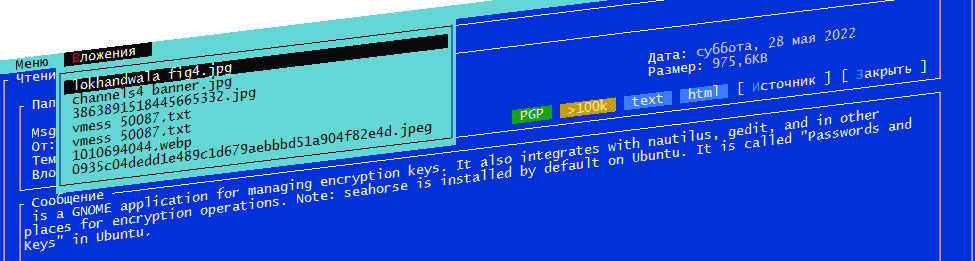

  

### Home Mail Hub

To date, these of a mobile device of any e-mail application known brands as Google Mail, Yandex Mail, MailRu, Microsoft Mail, etc.  - transmit your sensitive data, including network routing table, including the IP address of your ISP, IP address VPN, and GEO coordinates on the basis of the IP address, or GPS.

  

#### Change this situation possible.  
 First of all, stop using the original e-mail clients from the postal service aggregators.
 The next step, the installation of an intermediary for the delivery and receipt of e-mail messages that should do the following:  

#### 1. When sending a message:  
  - 1.1 to clean the messages from the additional information, if any, was added to the headers of the message by the client,  
  - 1.2 to communicate with an external mail server only through anonymous and protected channels, such as VPN, Proxy,  
  - 1.3 in terms of aggregators mail services, secure channel is the channel through which they can receive without hindrance from the user device, any confidential information without the knowledge and unbeknownst to the owner,  
  - 1.4 with regard to the external mail server, do not use keep alive Connection property, and break the connection immediately after the operation, it complicates the calculation of the real IP address when using a proxy server and VPN connection.  

#### 2. When you receive a message:  
 - 2.1 convert the body of the message in text format, and compiling and including in the processed message a list of external links, that may have "dual use",  
 - 2.2 delete headers, causing a variety of confirmation and additional, not controlled by you to generate e-mail traffic.  

 All of the above and some additional security features implemented in HomeMailHub.  
 The app is absolutely free, contains no advertising or other "tabs", distributed as OpenSource with available source code.

[ScreenShots Gallery](gallery.md)  
